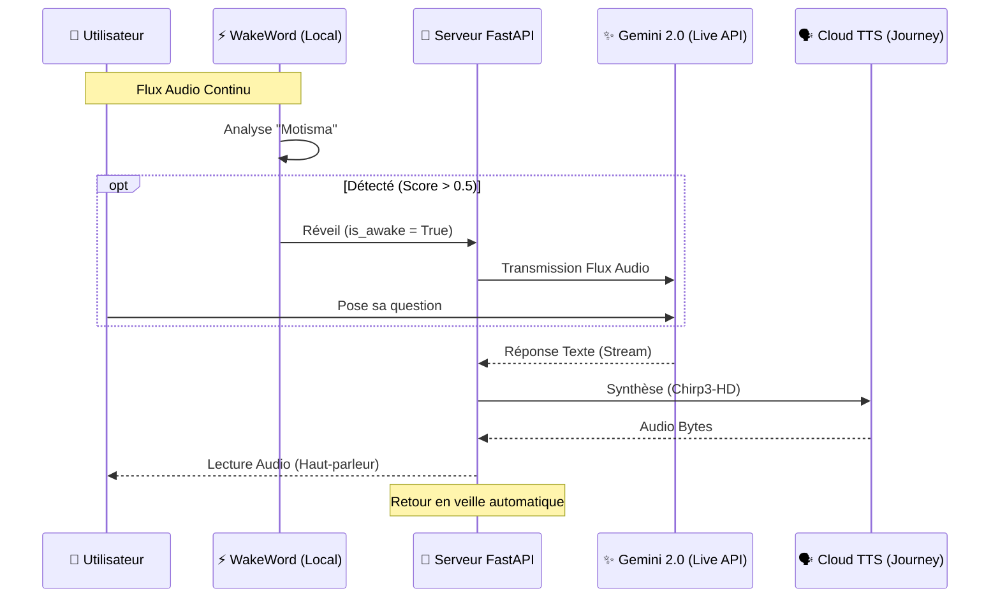

# 🧠 Jarvis Native Core (V1.5)

**Jarvis Native Core** est le "Cerveau" central de votre assistant domotique multimodal. Il s'agit d'un serveur WebSocket Python haute performance conçu pour orchestrer des conversations fluides, intelligentes et naturelles.

---

## 🏛️ Architecture Technique & Décisions d'Expert

Ce projet repose sur des choix d'ingénierie précis pour équilibrer **Intelligence**, **Réactivité** et **Qualité Vocale**.

### 1. Pourquoi l'API "Live" (v1alpha) ?
L'API **Live** (via WebSocket `bidiGenerateContent`) est activée pour minimiser la latence. Contrairement aux appels HTTP classiques (3-5s de délai), le flux audio est envoyé **pendant que vous parlez**. Gemini commence à traiter la requête avant même la fin de la phrase, ramenant la latence perçue à **moins d'une seconde**.

### 2. Le Pipeline Hybride (Le choix du Design)
Nous avons délibérément choisi un mode **Hybride** plutôt que le mode "Native Audio" complet pour le moment :
*   **Intelligence** : Google Gemini 2.0 Flash (API Live) reçoit l'audio utilisateur et génère du **Texte**.
*   **Voix** : Le texte est envoyé au service **Google Cloud TTS (Chirp3-HD)**.
*   **Raison** : Les voix natives de Gemini (Puck, Fenrir...) ont un accent français limité. En utilisant les modèles **Journey** (Chirp3-HD), nous obtenons une qualité studio "Cinéma" pour la réponse.

### 3. Modèles Compatibles & Limitations
*   **Recommandé** : `gemini-2.0-flash` ou `gemini-2.0-flash-exp`. Ces modèles sont optimisés pour le tunnel WebSocket.
*   **Limitation** : Les modèles `2.5-pro` ou `3-flash` ne sont pas encore pleinement supportés sur le canal Live bidirectionnel (Erreur 1008/1007). Ils nécessitent un mode "Burst" HTTP qui augmente drastiquement la latence (non validé).
*   **Native Audio** : Le modèle `2.5-flash-native-audio` impose ses propres voix. Il est incompatible avec notre pipeline de voix haute qualité Journey si nous demandons uniquement du texte.

---

## ✨ Fonctionnalités Implémentées

*   **⚡ Latence Ultra-Faible** : Communication temps réel via WebSocket.
*   **🗣️ Voix Journey (Zephyr)** : Utilisation de `fr-FR-Chirp3-HD-Zephyr` pour une élocution humaine.
*   **⚡ Wake Word "Motisma"** : Protection par mot de réveil local via `openWakeWord`. L'audio n'est envoyé à Gemini que si "Motisma" est détecté (Score > 0.5).
*   **✋ Interruption ("Barge-in")** : VAD (Voice Activity Detection) locale permettant de couper la parole à Jarvis instantanément.
*   **🛠️ Tools & Web Search** : Support natif de la recherche Google (Google Search Grounding) pour des réponses à jour.

---

## 🏗️ Structure du Flux (Sequence Diagram)



---

## 🚀 Installation & Démarrage

### Pré-requis
*   Python 3.10+
*   Compte Google Cloud (Projet ID avec Vertex AI activé).
*   API Key Google (dans `.env`).

### Configuration rapide (.env)
```ini
GOOGLE_API_KEY=votre_cle_api
GEMINI_MODEL_ID=gemini-2.0-flash
TTS_VOICE_NAME=fr-FR-Chirp3-HD-Zephyr
SYSTEM_INSTRUCTION="Tu es Jarvis, assistante domotique..."
```

### Lancement
1.  **Lancer le Serveur** :
    ```bash
    .\venv\Scripts\python -m uvicorn app.main:app --host 0.0.0.0 --port 8000
    ```
2.  **Lancer le Client de test** :
    ```bash
    .\venv\Scripts\python scripts/audio_loop.py
    ```

---

## 🗺️ Roadmap Actualisée

### Phase 1 & 1.5 : Core & Qualité [VÉRIFIÉ ✅]
- [x] WebSocket Bidirectionnel Gemini Live API.
- [x] Intégration Wake Word "Motisma" (ONNX/OpenWakeWord).
- [x] Pipeline Hybride Journey/Chirp3-HD pour la voix.
- [x] Système de logging granulaire (Scores de détection).

### Phase 2 : Tools & Intelligence [EN COURS 🛠️]
- [ ] Activation `google_search` tools dans la config `GeminiClient`.
- [ ] Connecteur Home Assistant (Function Calling).

### Phase 3 : Hardware ESP32 & Speaker ID [À VENIR]
- [ ] Firmware ESP32-S3 pour streaming direct.
- [ ] Speaker Identification (Reconnaissance de l'utilisateur).
- [ ] Gestion multi-satellites.
